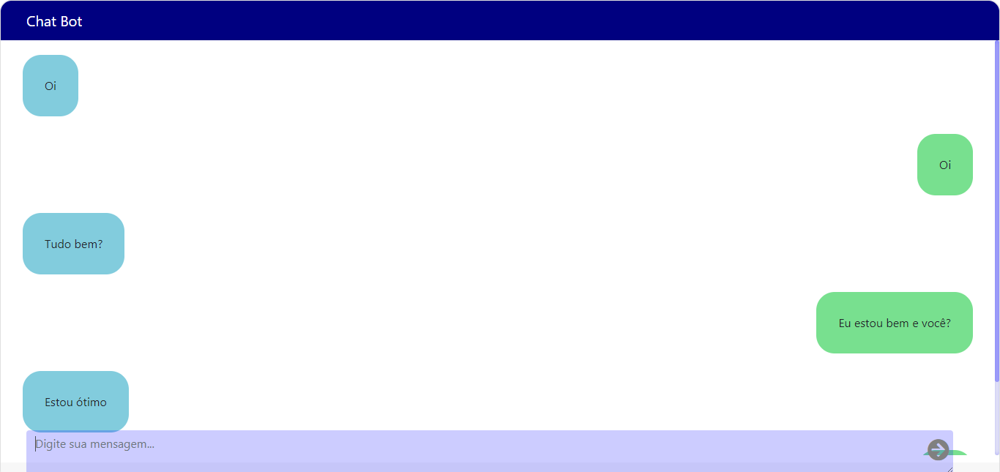

# ChatBot

* Origin https://github.com/Six-wars/django-chat.

* Django Project with [ChatterBot](https://github.com/gunthercox/ChatterBot) as the chatbot. The frontend using VueJS.

## Install Project

* Requirements saved in `req.txt`

''' 
pip install -r req.txt
'''

* Once you have installed all, you can running the following command:

'''
python3 comedy/manager.py runserver
'''

* Once you have it running type message into textbox and it will return a message.

